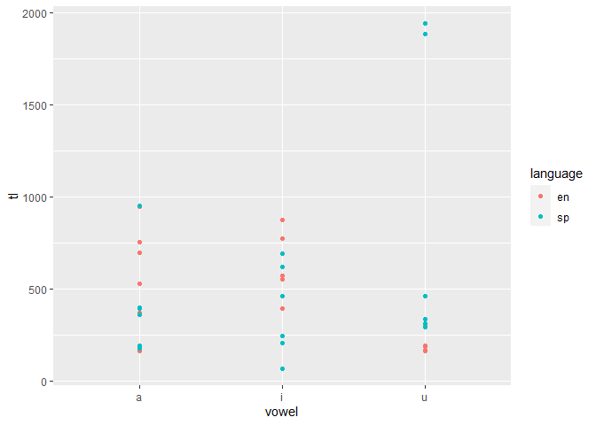
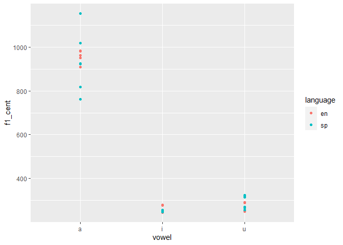
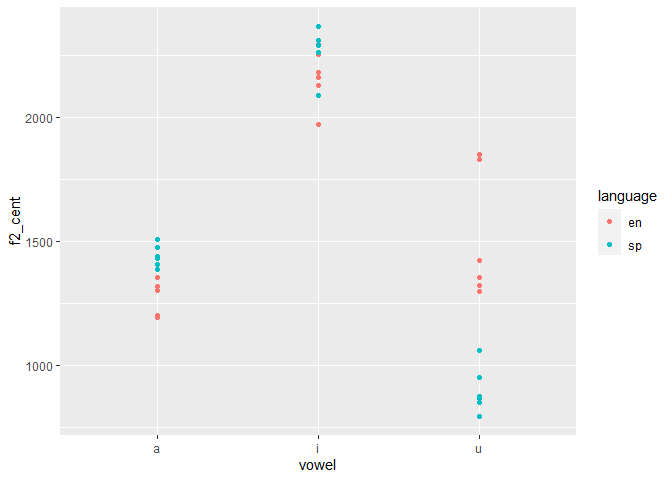

Programming Assignment 3
================

## Load libraries and data

``` r
library(tidyverse)
library(untidydata)
library(ggplot2)
library(readr)
```

``` r
library(readr)
vowel_data <- read_csv("pa_3/data/vowel_data.csv")
```

    ## Parsed with column specification:
    ## cols(
    ##   id = col_character(),
    ##   item = col_character(),
    ##   vowel = col_character(),
    ##   language = col_character(),
    ##   f1_cent = col_double(),
    ##   f2_cent = col_double(),
    ##   tl = col_double(),
    ##   f1_20 = col_double(),
    ##   f1_35 = col_double(),
    ##   f1_50 = col_double(),
    ##   f1_65 = col_double(),
    ##   f1_80 = col_double(),
    ##   f2_20 = col_double(),
    ##   f2_35 = col_double(),
    ##   f2_50 = col_double(),
    ##   f2_65 = col_double(),
    ##   f2_80 = col_double()
    ## )

``` r
View(vowel_data)
```

### 

## 1\. Respond to the following questions:

## Examine the portion of the script you see below. In your own words what does this section do and why does it work? \#\# Demonstrate that you understand the code….

vonset = Get starting point: 2, 2  
voffset = Get end point: 2, 2 durationV = voffset - vonset

The first three lines are saying to get starting and end points within
the segmented data and defining “durationV” as an item that is the
difference between the onset and the offset of the vowel. “2,2” is
saying that the information is in the second interval tier

\#per20 = vonset + (durationV \* 0.20) \#per35 = vonset + (durationV \*
0.35) \#per50 = vonset + (durationV \* 0.50) \#per65 = vonset +
(durationV \* 0.65) \#per80 = vonset + (durationV \* 0.80)

This portion is defining the percentage of the vowels at a particular
duration. For example, the first line say that the new item “per20” is
equal to the vonset (retrieved by the previous code) plus the duration
between onset and offset time .2, to identify the precise time in ms
where 20% of the way through the vowel is at a particular point in time.
The following lines perform the same procedure at different time points.

## 2\. In a few short sentences describe the general outline of the script, what the purpose is, and how it acheives \#\# this purpose (hint: focus on the section dividers and the comments)

The first part of the script defines a relative path for the file to be
saved at, the name of the file, and appends the file with column
headers.

The second part tells the program where to read the data from using
another relative path, and to read from files ending in .wav and
.TextGrid in that filepath

The loop is reading the data and telling the program where to put data
from the wav and textgrid files in the spreadsheet. For example, vowel$
= Get label of interval: 2, interval has the program read the label we
gave the vowel sounds in the textgrid at interval 2 and defines this
information as the object “vowel” later this information is printed to
the csv file under the column “vowel”.

The statistical data is likewise formulated later in the loop and
assigned to objects.

The end of the code makes the program write the data from these newly
calculated objects to a csv file.

## 3\. In a few short sentences describe how the segmenting procedure you used this week differs from that used in pa\_2. What are the advantages and disadvantages?

The segmentation in PA\_3 extracted data from one large file, rather
than segmenting them into many smaller files. Only having one file can
be nice to avoid potential clutter, but it seems that addressing outlier
data that is the result of an anomaly in the recording process (like my
dogs barking every six seconds when I am trying to record) could be more
easily dealt with if a single phrase could be re-recorded and overwrite
the old sound file after segmentation.

## 

## Descriptive statistics

``` r
# Calculate means and standard deviations of your English/Spanish vowels ------

mean_f1_cent = mean(vowel_data$f1_cent)
mean_f2_cent = mean(vowel_data$f2_cent)
mean_tl_cent = mean(vowel_data$tl)
standard_deviation_f1 = sd(vowel_data$f1_cent)
standard_deviation_f2 = sd(vowel_data$f2_cent)
standard_deviation_tl = sd(vowel_data$tl)

print(mean_f1_cent)
```

    ## [1] 492.0544

``` r
print(mean_f2_cent)
```

    ## [1] 1598.737

``` r
print(mean_tl_cent)
```

    ## [1] 517.3081

``` r
print(standard_deviation_f1)
```

    ## [1] 327.8179

``` r
print(standard_deviation_f2)
```

    ## [1] 499.4406

``` r
print(standard_deviation_tl)
```

    ## [1] 421.2877

``` r
# -----------------------------------------------------------------------------
```

## Plots

``` r
# 1. Plot trajectory length as a function of vowel and language ---------------


ggplot(data = vowel_data, aes(x = vowel, y = tl, color = language)) + geom_point() 
```

<!-- -->

``` r
# -----------------------------------------------------------------------------
```

``` r
# 2. Plot F1 as a function of vowel and language ------------------------------

ggplot(data = vowel_data, aes(x = vowel, y = f1_cent, color = language)) + geom_point() 
```

<!-- -->

``` r
# -----------------------------------------------------------------------------
```

``` r
# 3. Plot F2 as a function of vowel and language ------------------------------


ggplot(data = vowel_data, aes(x = vowel, y = f2_cent, color = language)) + geom_point() 
```

<!-- -->

``` r
# -----------------------------------------------------------------------------
```

## Challenge (bonus points)

``` r
# Plot trajectory length in the F1/F2 vowel space -----------------------------

#
# Hints: 
# You will need to do some intense data manipulations first
# Check the help files for pivot_longer (?pivot_longer)
# You will need a combination of group_by, summarize, and pivot_longer 
# (in that order)
#


# -----------------------------------------------------------------------------
```

## FREEBIE

``` r
# Plot both vowel spaces together ---------------------------------------------

#
# This assumes your dataframe is called 'vowels'
# Before it will work you need to change 'eval=F' to 'eval=T'
#

vowel_means <- vowel_data %>% 
  group_by(vowel, language) %>% 
  summarize(f1_cent = mean(f1_cent), f2_cent = mean(f2_cent)) %>% 
  ungroup() %>% 
  mutate(order = case_when(vowel == "i" ~ 1, vowel == "a" ~ 2, TRUE ~ 3), 
         vowel = forcats::fct_reorder2(vowel, vowel, order)) %>% 
  arrange(order)

vowel_data %>% 
  mutate(vowel = forcats::fct_relevel(vowel, "u", "a", "i")) %>% 
  ggplot(., aes(x = f2_cent, y = f1_cent, color = language, label = vowel)) + 
    geom_text(size = 3.5, alpha = 0.6, show.legend = F) + 
    geom_path(data = vowel_means, aes(group = language, lty = language), 
              color = "grey") + 
    geom_text(data = vowel_means, show.legend = F, size = 7) + 
    scale_y_reverse() + 
    scale_x_reverse() + 
    scale_color_brewer(palette = "Set1") + 
    labs(title = "Vowel space comparison", 
         subtitle = "Spectral centroids of English/Spanish cardinal vowels", 
         y = "F1 (hz)", x = "F2 (hz)") + 
    theme_minimal(base_size = 16)

# -----------------------------------------------------------------------------
```
